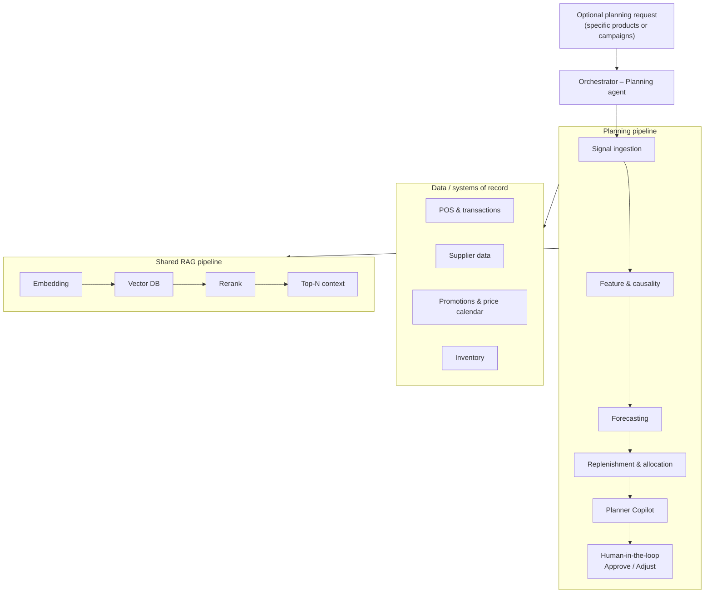

# Agentic Inventory Planning and Trend Forecasting

The main purpose of this repository is to show a real-world use case of **retail inventory planning and trend forecasting** by integrating **Grok 4.3** (xAI), Microsoft Foundry, and Microsoft Agent Framework.

You can find in the directory the dataset-seed, infrastructure, code, and deployment for a five-agent planning pipeline that turns supply-chain signals into human-approved replenishment decisions.

- **Demo inputs:** [`dataset-seed/README.md`](dataset-seed/README.md) — runtime case data for API and MCP
- **Reference / rebuild:** [`data-generation/README.md`](data-generation/README.md) — corpus, scripts, ground truth; [how runtime discovers scenarios](data-generation/README.md#how-runtime-discovers-scenarios)

Click on **Deploy to Azure** and see how it works in your Azure subscription.

[](https://portal.azure.com/#create/Microsoft.Template/uri/https%3A%2F%2Fraw.githubusercontent.com%2Fsouthworks%2Finesite-agentic-inventory-planning%2Fmain%2Finfra%2Fazuredeploy.json/createUiDefinition.uri/https%3A%2F%2Fraw.githubusercontent.com%2Fsouthworks%2Finesite-agentic-inventory-planning%2Fmain%2Finfra%2FcreateUiDefinition.json)

Below you can see the workflow diagram of the entire solution.



Reference user story: [US 128593](https://dev.azure.com/southworks/inesite/_workitems/edit/128593). For the full business and functional reference, see [workflow-summary.md](workflow-summary.md).

## Deploy to Azure

The primary deployment path is a single end-to-end Azure deployment from the README button.

When you deploy:

1. Azure provisions Foundry (Grok 4.3, embedding, and rerank model deployments), AI Search, and Container Apps.
2. The API and MCP hosts start as Azure Container Apps. Demo case data is bundled inside the MCP image at `/app/dataset-seed`.
3. The MCP ensures Search indexes exist on startup (`inventory-signal-evidence`, `promotions-price-knowledge`).
4. A deployment script starts the agent provisioning Container Apps Job and waits for it to finish.
5. The deployment outputs the live API and MCP URLs, Foundry project endpoint, and Search service name.

You do **not** need to run a separate agent CLI after deployment.

Container images are published automatically to GitHub Container Registry by [.github/workflows/publish-container-images.yml](.github/workflows/publish-container-images.yml) on pushes to `main`. The deployment template uses these default image URIs:

- `ghcr.io/southworks/inventoryplanning-api:demo`
- `ghcr.io/southworks/inventoryplanning-mcp:demo`
- `ghcr.io/southworks/inventoryplanning-provisioning:demo`
- `ghcr.io/southworks/inventoryplanning-web:demo`

Make the GHCR packages public after the first workflow run so Azure Container Apps can pull them without registry credentials.

### After deployment

Open the `apiUrl` output from the deployment and use the API endpoints below. Seeded demo cases `case-01` through `case-05` work out of the box — case metadata and prerequisite entities are bundled in the MCP container under `dataset-seed/cases/{caseId}/fabric-pre-requisite-data/`.

The MCP exposes five agent-specific endpoints (for example `/signal-ingestion/mcp`). Each Foundry prompt agent connects directly to its dedicated MCP path during workflow execution. See [backend/GrokInventoryAndTrend.Mcp/README.md](backend/GrokInventoryAndTrend.Mcp/README.md).

To enable the Blazor frontend Container App, redeploy `infra/main.bicep` with `deployFrontend=true` after the web image is published.

## Architecture

`signal-ingestion-agent` → `feature-and-causality-agent` → `forecasting-agent` → `replenishment-and-allocation-agent` → `planner-copilot-agent` → human approval

The API orchestrates the workflow. Foundry prompt agents execute each step and call the public MCP endpoints exposed by [backend/GrokInventoryAndTrend.Mcp](backend/GrokInventoryAndTrend.Mcp/README.md).

RAG (embedding → Azure AI Search → Cohere rerank) supports signal evidence search and promotions retrieval. Only **Signal Ingestion** reads case-scoped data via MCP tools in the demo; downstream agents run on workflow memory. Agent definitions are provisioned automatically during deployment — see [agent-provisioning/README.md](agent-provisioning/README.md).

| Agent | Responsibility |
| --- | --- |
| `signal-ingestion-agent` | Ingest POS, inventory, supplier, and promotion signals; validate data quality |
| `feature-and-causality-agent` | Build predictors; measure demand drivers (price, promo, seasonality) |
| `forecasting-agent` | Short-term demand forecast; detect trends, shifts, and anomalies |
| `replenishment-and-allocation-agent` | Recommend stock targets and draft PO/TO orders |
| `planner-copilot-agent` | Enforce budget and service-level constraints for human approval |

## Demo limitations

This is intentionally a simple demo:

- Workflow executions are kept in memory only and are lost if the API restarts.
- The API runs as a single Container App replica.
- MCP auth is open for the demo host.
- Human approval (Planner Review) is handled **client-side** in the Blazor UI — there is no backend resume endpoint.
- The frontend Container App is disabled by default (`deployFrontend=false`).
- Case-scoped signal data for MCP tools is read from bundled `dataset-seed/cases/{caseId}/fabric-pre-requisite-data/` inside the MCP container. The API does not expose create-case or signal-upload endpoints.

## API Endpoints

- `GET /health` — health probe
- `POST /api/inventory-planning/cases/{caseId}/workflow/basic/start` — start the basic Agent Framework workflow for a seeded demo case
- `GET /api/inventory-planning/executions/{executionId}/basic/status` — poll workflow status and agent outputs
- `GET /api/inventory-planning/cases/{caseId}/documents` — list ingest documents for a case
- `GET /api/inventory-planning/cases/{caseId}/documents/content?documentPath=...` — download a case document

Supported demo cases: `case-01` … `case-05`.

The start endpoint returns an `executionId`. Use that value for status polling.

### Status response shape

```json
{
  "executionId": "abc123...",
  "caseId": "case-01",
  "status": "Running",
  "agentOutputs": {
    "signalIngestion": null,
    "featureCausality": null,
    "forecasting": null,
    "replenishmentAllocation": null,
    "plannerCopilot": null
  },
  "failureReason": null,
  "lastUpdatedUtc": "2026-06-22T12:00:00Z"
}
```

Possible `status` values: `Pending`, `Running`, `Completed`, `Failed`.

## UI Integration Pattern

1. Pick a seeded demo case such as `case-01` (seasonal happy path), `case-02` (promotion budget review), or `case-05` (demand anomaly).
2. Start the workflow with `POST /api/inventory-planning/cases/{caseId}/workflow/basic/start`.
3. Save the returned `executionId`.
4. Poll `GET /api/inventory-planning/executions/{executionId}/basic/status` every ~2 seconds.
5. When `status` becomes `Completed`, show `agentOutputs.plannerCopilot` (and earlier agent outputs) to the reviewer.
6. Present **Approve / Reject** in the UI — this is a client-side gate and is not persisted to the backend.
7. Display the outcome summary.

Case metadata for the Home page comes from `dataset-seed/cases/catalog.json`.

| Case | Title | Expected outcome |
| --- | --- | --- |
| `case-01` | Seasonal happy path | Clean holiday forecast; order approved |
| `case-02` | Promotion → budget review | Order within budget; planner budget HITL |
| `case-03` | Supplier delay → expedite | Expedite required; planner service-level HITL |
| `case-04` | Partial fill → reorder | Reorder approved (MOQ) |
| `case-05` | Demand anomaly → no action | Anomaly flagged; no supply order; forecasting HITL |

## Structured Agent Output

Each Foundry agent must return JSON compatible with:

```json
{
  "summary": "Concise explanation of the step outcome.",
  "decision": "The agent recommendation or outcome.",
  "evidence": "Key facts or rationale supporting the decision."
}
```

`forecasting-agent` and `planner-copilot-agent` use extended strict schemas. See [agent-provisioning/README.md](agent-provisioning/README.md).

If an agent returns invalid or missing structured output, the case fails fast with an explicit error.

## Local Development

Local development is optional and separate from the Azure deployment path.

### Prerequisites

- .NET 9 SDK
- Azure CLI login or another credential available to `DefaultAzureCredential`
- An Azure AI Foundry project with the five demo prompt agents already deployed
- Local `dataset-seed` assets (included in the repo)

### Run locally

#### VS Code / Cursor (recommended)

1. Install the [C# Dev Kit](https://marketplace.visualstudio.com/items?itemName=ms-dotnettools.csdevkit) extension (recommended when opening the repo).
2. Copy [`backend/GrokInventoryAndTrend.Api/.env.local.example`](backend/GrokInventoryAndTrend.Api/.env.local.example) to `backend/GrokInventoryAndTrend.Api/.env.local` and fill in your Azure values.
3. Sign in with Azure CLI (`az login`) or another credential available to `DefaultAzureCredential`.
4. Open **Run and Debug** and start **API + MCP** (add **WebApp** separately for the Blazor UI).

Default URLs when debugging:

- API: `http://localhost:5038`
- MCP: `http://localhost:5040`
- Web UI: `http://localhost:5147`

#### Command line

```powershell
cd backend/GrokInventoryAndTrend.Api

$env:AZURE_FOUNDRY_PROJECT_ENDPOINT = "https://your-project.services.ai.azure.com/api/projects/your-project"
$env:Dataset__RootPath = "C:\path\to\inesite-agentic-inventory-planning\dataset-seed"

dotnet run --launch-profile http
```

Open the API at `http://localhost:5038`.

Copy [`backend/GrokInventoryAndTrend.Api/.env.local.example`](backend/GrokInventoryAndTrend.Api/.env.local.example) for all env var names.

Run the MCP host separately:

```powershell
cd backend/GrokInventoryAndTrend.Mcp
dotnet run
```

Default MCP URL: `http://localhost:5040`

Run the Blazor frontend separately:

```powershell
cd frontend/src/GrokInventoryAndTrend.WebApp
dotnet run --launch-profile http
```

Open the UI at `http://localhost:5147`. Override the backend URL if needed:

```powershell
$env:PlanningApi__BaseUrl = "http://localhost:5038/"
```

Prompt agent definitions are provisioned by [agent-provisioning/](agent-provisioning/README.md) during Azure deployment. For local experiments, run the provisioning CLI against your project endpoint and MCP base URL.

## Packages

```powershell
dotnet add package Azure.Identity
dotnet add package Microsoft.Agents.AI.AzureAI --prerelease
dotnet add package Microsoft.Agents.AI.Workflows --prerelease
```
