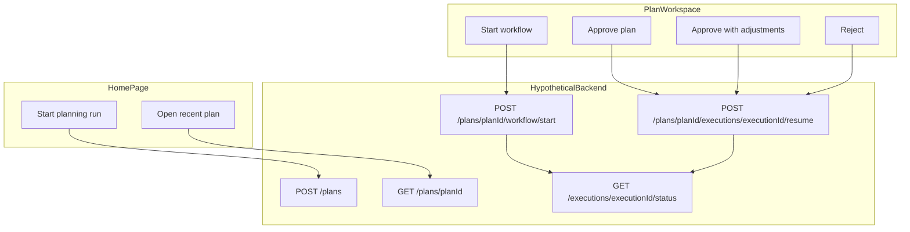

# UI → API Endpoint Mapping

This document maps every button and actionable control on the **Home** and **Plan Workspace** pages to the hypothetical backend HTTP endpoints they would call when the app runs in **Remote** mode.

For implementation details (wire DTOs, mappers, configuration), see [`src/WebApp/BACKEND_INTEGRATION.md`](src/WebApp/BACKEND_INTEGRATION.md).

---

## Overview

The frontend is a **Blazor Server** app. All data actions flow through `IPlanningApiClient` (`src/WebApp/Services/IPlanningApiClient.cs`).

| Mode | Config value | Behavior |
|------|--------------|----------|
| **Local** (default) | `PlanningApi:Mode = "Local"` | In-memory simulation via `LocalPlanningApiClient`; no backend HTTP |
| **Remote** | `PlanningApi:Mode = "Remote"` | HTTP calls to `PlanningApi:BaseUrl` (default `http://localhost:5038/`) via `PlanningApiClient` |

Endpoints below use the prefix `/api/inventory-planning/`. Paths marked **provisional** are not yet implemented in `PlanningApiClient` but follow the same convention as the workflow endpoints already coded.

---

## Data flow

---

## Home page (`/`)

**Page file:** `src/WebApp/Components/Pages/Home.razor`

| UI label | Component | User action | API client method | Hypothetical endpoint | HTTP | Request body | Remote status |
|----------|-----------|-------------|-------------------|----------------------|------|--------------|---------------|
| **Start planning run** | `Components/Plans/ScenarioPreviewPanel.razor` | Creates a plan from the selected scenario, then navigates to `/plans/{planId}` | `CreatePlanAsync(scenarioId)` | `/api/inventory-planning/plans` | `POST` | `{ "scenarioId": "<scenarioId>" }` | **Not implemented** — throws `NotSupportedException`; local session only |
| **Open** | `Components/Plans/RecentPlanRow.razor` | Navigates to `/plans/{planId}` (workspace loads plan on arrival) | `GetPlanAsync(planId)` | `/api/inventory-planning/plans/{planId}` | `GET` | — | **Not implemented** — reads local `PlanSessionStore` |
| **Retry** | `Components/Common/ErrorState.razor` | Re-runs page load after a failure | `GetScenariosAsync()` | `/api/inventory-planning/scenarios` | `GET` | — | Scenarios always read from local `dataset-seed/` catalog |

**Handler chain for Start planning run:** `ScenarioPreviewPanel` → `Home.StartSelectedScenario()` → `ApiClient.CreatePlanAsync()` → `Navigation.NavigateTo("/plans/{planId}")`.

**Expected response for CreatePlan (provisional):** maps to `PlanDetailResponse` in `Contracts/PlanContracts.cs` (`planId`, `scenarioId`, `title`, `description`, `context`, `status`, `allowedActions`).

---

## Plan Workspace (`/plans/{planId}` and `/plans/{planId}/{executionId}`)

**Page file:** `src/WebApp/Components/Pages/PlanWorkspace.razor`

| UI label | Component | User action | API client method | Hypothetical endpoint | HTTP | Request body | Remote status |
|----------|-----------|-------------|-------------------|----------------------|------|--------------|---------------|
| **Start workflow** | `PlanWorkspace.razor` (`LoadingButton`) | Starts the five-agent pipeline, navigates to `/plans/{planId}/{executionId}`, begins polling | `StartWorkflowAsync(planId)` | `/api/inventory-planning/plans/{planId}/workflow/start` | `POST` | — (empty body) | **Implemented** |
| **Approve plan** | `Components/HumanReview/PlannerApprovalPanel.razor` | Submits human approval; workflow resumes to terminal state | `SubmitHumanDecisionAsync(planId, executionId, request)` | `/api/inventory-planning/plans/{planId}/executions/{executionId}/resume` | `POST` | `{ "decision": "Approve", "notes": "<optional>" }` | **Implemented** |
| **Approve with adjustments** | `PlannerApprovalPanel.razor` | Submits approval with required reviewer notes | same | same | `POST` | `{ "decision": "ApproveWithAdjustments", "notes": "<required>" }` | **Implemented** |
| **Reject** | `PlannerApprovalPanel.razor` | Rejects the plan; workflow moves to failed terminal state | same | same | `POST` | `{ "decision": "Reject", "notes": "<optional>" }` | **Implemented** |
| **Retry** | `Components/Common/ErrorState.razor` | Re-loads plan and optional execution status | `GetPlanAsync(planId)` + `GetWorkflowStatusAsync(executionId)` | `/api/inventory-planning/plans/{planId}` + `/api/inventory-planning/executions/{executionId}/status` | `GET` | — | Partially implemented (status only) |
| **← Back to retail planning** | `PlanWorkspace.razor` | Navigates to `/` | — | — | — | — | Client-only |

**Button enablement:**
- **Start workflow:** enabled when plan status is `Pending` and `allowedActions` contains `"StartWorkflow"`.
- **Approve / Approve with adjustments / Reject:** enabled when workflow status is `AwaitingHumanApproval`. "Approve with adjustments" is disabled when reviewer notes are empty.

**Decision enum** (`HumanDecisionType` in `Contracts/PlanContracts.cs`): `Approve`, `ApproveWithAdjustments`, `Reject`.

**Wire response DTOs** for implemented endpoints: `Contracts/Api/Backend/InventoryPlanningBackendContracts.cs` (`BackendStartWorkflowResponse`, `BackendWorkflowStatusResponse`, `BackendStageStatus`).

---

## Implicit / non-button API calls

These are triggered automatically on page load or as side effects of button actions — not tied to a specific button click.

| Trigger | API client method | Hypothetical endpoint | HTTP | Remote status |
|---------|-------------------|----------------------|------|---------------|
| Home page load | `GetScenariosAsync()` | `/api/inventory-planning/scenarios` | `GET` | Local seed catalog only (provisional endpoint) |
| Workspace page load | `GetPlanAsync(planId)` | `/api/inventory-planning/plans/{planId}` | `GET` | **Not implemented** (local session) |
| Workspace load with `{executionId}` in URL | `GetWorkflowStatusAsync(executionId)` | `/api/inventory-planning/executions/{executionId}/status` | `GET` | **Implemented** |
| After **Start workflow** or while run is active | `GetWorkflowStatusAsync(executionId)` (polling) | `/api/inventory-planning/executions/{executionId}/status` | `GET` | **Implemented** |
| After **Approve / Reject** | `SubmitHumanDecisionAsync` internally calls `GetWorkflowStatusAsync` | same status endpoint | `GET` | **Implemented** |

**Polling behavior** (`State/PlanWorkspaceState.cs`, config in `WorkflowPolling` section of `appsettings.json`):

- Interval: every **2 seconds** (`IntervalSeconds`)
- Stops when status reaches `Completed`, `Failed`, or `AwaitingHumanApproval`
- Timeout: **10 minutes** (`MaxDurationMinutes`)
- Restarts automatically if workspace is opened with an in-progress execution in the URL

---

## Client-only controls

These interactive elements do **not** call the backend in either Local or Remote mode.

| UI label | Page | Component | Behavior |
|----------|------|-----------|----------|
| Search scenarios… | Home | `Components/Plans/ScenarioPickerPanel.razor` | Client-side filter on loaded scenario list |
| Healthy run / Anomalies expected / Budget pressure / Service level risk | Home | `ScenarioPickerPanel.razor` | Toggle outcome-tag filter chips |
| Scenario list item (scenario title) | Home | `ScenarioPickerPanel.razor` | Selects scenario for preview panel |
| Signal Ingestion / Feature & Causality / Demand Forecast / Replenishment & Allocation / Planner review | Workspace | `Components/Layout/CollapsiblePageSection.razor` | Expand/collapse stage sections (local UI state) |
| Reviewer notes (textarea) | Workspace | `PlannerApprovalPanel.razor` | Binds local notes field; sent only when an approval button is clicked |
| Cohere Inventory & Trend / Home | All pages | `Components/Layout/TopBar.razor` | Blazor navigation to `/` |
| Reload (error banner) | All pages | `Components/Layout/MainLayout.razor` | Full page reload (Blazor circuit error UI) |

---

## Endpoint summary (quick reference)

All paths are relative to `PlanningApi:BaseUrl`.

| Method | Path | Triggered by | Remote status |
|--------|------|--------------|---------------|
| `GET` | `/api/inventory-planning/scenarios` | Home page load, Retry | Provisional |
| `POST` | `/api/inventory-planning/plans` | **Start planning run** | Provisional |
| `GET` | `/api/inventory-planning/plans/{planId}` | **Open** recent plan, workspace load, Retry | Provisional |
| `POST` | `/api/inventory-planning/plans/{planId}/workflow/start` | **Start workflow** | Implemented |
| `GET` | `/api/inventory-planning/executions/{executionId}/status` | Workspace load, polling, post-decision refresh | Implemented |
| `POST` | `/api/inventory-planning/plans/{planId}/executions/{executionId}/resume` | **Approve plan**, **Approve with adjustments**, **Reject** | Implemented |

---

## Related source files

| Purpose | Path |
|---------|------|
| API client interface | `src/WebApp/Services/IPlanningApiClient.cs` |
| Remote HTTP implementation | `src/WebApp/Services/PlanningApiClient.cs` |
| Local simulation | `src/WebApp/Services/LocalPlanningApiClient.cs` |
| UI DTOs | `src/WebApp/Contracts/PlanContracts.cs` |
| Backend wire DTOs | `src/WebApp/Contracts/Api/Backend/InventoryPlanningBackendContracts.cs` |
| Home page handlers | `src/WebApp/Components/Pages/Home.razor` |
| Workspace handlers & polling | `src/WebApp/Components/Pages/PlanWorkspace.razor`, `src/WebApp/State/PlanWorkspaceState.cs` |
| Backend integration playbook | `src/WebApp/BACKEND_INTEGRATION.md` |
