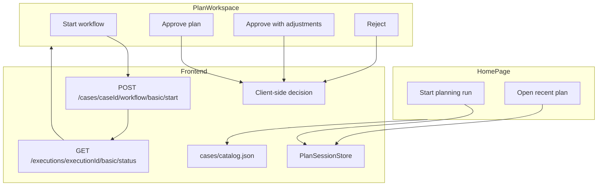

# UI → API Endpoint Mapping

This document maps every button and actionable control on the **Home** and **Plan Workspace** pages to the backend HTTP endpoints (or client-side actions) used by the frontend.

For implementation details (wire DTOs, mappers, configuration), see [`src/GrokInventoryAndTrend.WebApp/BACKEND_INTEGRATION.md`](src/GrokInventoryAndTrend.WebApp/BACKEND_INTEGRATION.md).

---

## Overview

The frontend is a **Blazor Server** app. All data actions flow through `IPlanningApiClient` (`src/GrokInventoryAndTrend.WebApp/Services/IPlanningApiClient.cs`), implemented by `PlanningApiClient` (HTTP to backend).

| Config | Default | Purpose |
|--------|---------|---------|
| `PlanningApi:BaseUrl` | `http://localhost:5038/` | Backend API base URL |
| `DatasetSeed:RootPath` | `../../../dataset-seed` | Repo-root dataset (case catalog) |

Case list metadata: `dataset-seed/cases/catalog.json` via `BackendCaseCatalogService`.

---

## Local development (two terminals)

| App | URL |
|-----|-----|
| Backend | `http://localhost:5038` |
| Frontend | `http://localhost:5147` |

The browser talks only to the frontend. The Blazor server calls the backend via `HttpClient` (no browser CORS).

---

## Data flow

---

## Home page (`/`)

**Page file:** `src/GrokInventoryAndTrend.WebApp/Components/Pages/Home.razor`

| UI label | Component | User action | API client method | Source / endpoint | HTTP |
|----------|-----------|-------------|-------------------|-------------------|------|
| **Start planning run** | `ScenarioPreviewPanel.razor` | Creates a plan from the selected case | `CreatePlanAsync(scenarioId)` | Client session | — |
| **Open** | `RecentPlanRow.razor` | Navigates to `/plans/{planId}` | `GetPlanAsync(planId)` | Client session | — |
| **Retry** | `ErrorState.razor` | Re-runs page load | `GetScenariosAsync()` | `dataset-seed/cases/catalog.json` | — |

`scenarioId` is a backend case id (`case-01` … `case-05`).

---

## Plan Workspace (`/plans/{planId}` and `/plans/{planId}/{executionId}`)

**Page file:** `src/GrokInventoryAndTrend.WebApp/Components/Pages/PlanWorkspace.razor`

| UI label | API client method | Endpoint | HTTP | Notes |
|----------|-------------------|----------|------|-------|
| **Start workflow** | `StartWorkflowAsync(planId)` | `/api/inventory-planning/cases/{caseId}/workflow/basic/start` | `POST` | Backend runs agents |
| **Approve / Reject** | `SubmitHumanDecisionAsync(...)` | — | — | Client-side (no backend resume API) |
| **Retry** | `GetPlanAsync` + `GetWorkflowStatusAsync` | session + `/executions/{executionId}/basic/status` | `GET` | |

When backend returns `status: "Completed"`, the mapper shows `AwaitingHumanApproval` until the reviewer decides.

---

## Implicit API calls

| Trigger | Method | Endpoint |
|---------|--------|----------|
| Home load | `GetScenariosAsync()` | `dataset-seed/cases/catalog.json` |
| Workspace load | `GetPlanAsync(planId)` | Client session |
| Workspace with executionId | `GetWorkflowStatusAsync(executionId)` | `GET .../executions/{id}/basic/status` |
| During workflow | Polling `GetWorkflowStatusAsync` | same (every 2s, max 25 min) |

---

## Backend endpoints not wired to UI

| Method | Path |
|--------|------|
| `GET` | `/api/inventory-planning/cases/{caseId}/documents` |
| `GET` | `/api/inventory-planning/cases/{caseId}/documents/content?documentPath=...` |
| `GET` | `/health` |

---

## Related source files

| Purpose | Path |
|---------|------|
| API client | `src/GrokInventoryAndTrend.WebApp/Services/PlanningApiClient.cs` |
| Case catalog | `src/GrokInventoryAndTrend.WebApp/Services/BackendCaseCatalogService.cs` |
| Wire DTOs | `src/GrokInventoryAndTrend.WebApp/Contracts/Api/Backend/InventoryPlanningBackendContracts.cs` |
| Mapper | `src/GrokInventoryAndTrend.WebApp/Services/BackendWorkflowMapper.cs` |
| Integration playbook | `src/GrokInventoryAndTrend.WebApp/BACKEND_INTEGRATION.md` |
