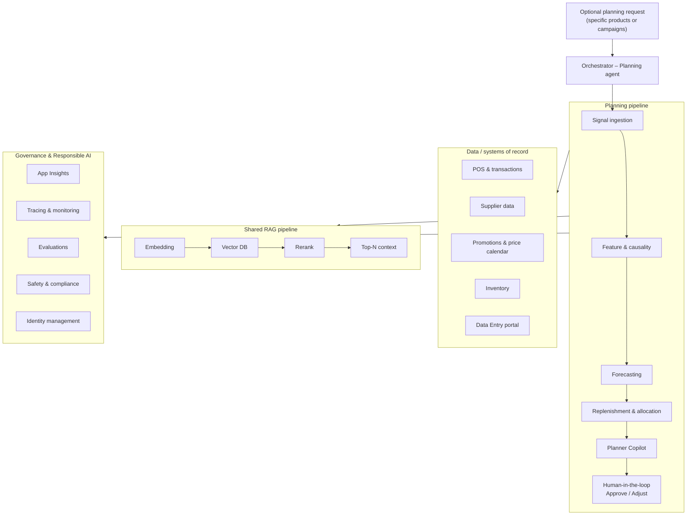

# Agentic Inventory Planning and Trend Forecasting — Workflow Summary

Business and functional reference for the agentic inventory planning and trend forecasting solution, built on **Microsoft Foundry**, **Agent Framework**, and **Grok 4.3**. The system is organized as a **single sequential planning pipeline** — five specialized agents coordinated by a Planning orchestrator — that turns real-time supply-chain signals into approved replenishment and allocation decisions.

---

## TL;DR

- The architecture is a **sequential multi-agent pipeline**.
- Five agents run **in order**, one after another:
  - **Signal ingestion** → **Feature & causality** → **Forecasting** → **Replenishment & allocation** → **Planner Copilot**
- The **Planning agent (orchestrator)** invokes each agent in sequence and passes accumulated context (memory) to the next step.
- The orchestrator connects to all agents to **coordinate** the flow; each agent runs **in sequence**, passing context to the next.
- **RAG** (Embedding → Vector DB → Rerank) supports signal-quality validation, short-term trend forecasting, and promotions & price-calendar retrieval.
- The pipeline ends with a **human-in-the-loop** approval gate in **Planner Copilot** (budget and service-level constraints). A human planner approves purchase and transfer orders before they are finalized.

---

## The planning pipeline

Each planning run walks the same chain. Every stage depends on the output of the previous one.

| | **Planning workflow** |
|---|-------------------------|
| **Purpose** | Turn real-time signals into demand forecasts, replenishment recommendations, and human-approved PO/TO drafts |
| **Agents** | Signal ingestion → Feature & causality → Forecasting → Replenishment & allocation → Planner Copilot |
| **Human gate** | Planner Copilot — approve or adjust the plan before orders are finalized |
| **Trigger** | Optional planning request (specific products, campaigns, or categories) |
| **Output** | Validated replenishment targets, allocation decisions, and draft PO/TO orders ready for human approval |

### Execution order

```
Signal ingestion → Feature & causality → Forecasting → Replenishment & allocation → Planner Copilot
```

| Agent | What it does | Implies it runs… |
|-------|--------------|------------------|
| **Signal ingestion** | Pulls real-time signals (sales, inventory, promotions, supplier data) and validates data quality (RAG) | **First** — reliable data is the foundation of every planning run |
| **Feature & causality** | Builds events and predictors; measures demand drivers (price, promo, seasonality) and elasticities | **After ingestion** — requires validated signals |
| **Forecasting** | Projects short-term demand; detects trends, shifts, and anomalies (RAG) | **After drivers are understood** — the forecast uses those variables |
| **Replenishment & allocation** | Translates expected demand into stock targets and draft PO/TO orders (purchase or transfer) | **After the forecast** — converts demand into replenishment actions |
| **Planner Copilot** | Checks budget and service-level constraints; presents the plan to a human planner for approval | **Last** — validates a proposed plan before orders are executed |

In supply-chain terms, execution follows: **data → drivers → forecast → replenishment → approval**.

**Logical sequence:**

1. Ingest data (sales, promotions, inventory, suppliers).
2. Understand causes (what moves demand).
3. Forecast demand and trends.
4. Replenish and allocate stock (what to order and where).
5. Validate business rules and obtain human approval.

---

## Workflow diagram



The orchestrator starts the pipeline and passes context between agents. Each agent reads and writes operational data through **Azure MCP**; RAG stages ground signal validation, trend forecasting, and promotions/price retrieval.

---

## Architecture layers

### 1. Orchestrator (Planning agent)

- **Role:** coordinate the specialized agents within the planning pipeline.
- **Input:** optional planning request (specific products, campaigns, or categories).
- **Function:** decide which agents run, in what order, and with what context; propagate memory between steps.
- **Implementation:** deployed as the primary agent on **Microsoft Foundry Agent Service**, orchestrating sub-agents via **Agent Framework**.

### 2. Specialized agents

Every agent shares the same technical stack:

| Component     | Technology                                |
|---------------|-------------------------------------------|
| Platform      | Microsoft Foundry Agent Service           |
| Orchestration | Agent Framework (Microsoft)               |
| Model         | Grok 4.3                                  |
| Memory        | Context across workflow steps             |
| Integration   | Azure MCP                                 |
| Retrieval     | Embedding + Vector DB + Rerank (TBD)      |

| Agent                          | Business responsibility                                                              |
|--------------------------------|--------------------------------------------------------------------------------------|
| **Signal ingestion**           | Ingest real-time signals; validate data quality (RAG)                                |
| **Feature & causality**        | Build events and predictors; measure driver impact and elasticities                  |
| **Forecasting**                | Short-term demand forecast (trend); detect shifts and anomalies (RAG)                |
| **Replenishment & allocation** | Recommend stock targets and orders; create draft POs/TOs                             |
| **Planner Copilot**            | Enforce service-level and budget constraints; human-in-the-loop                      |

#### Concrete actions (per diagram)

| Agent | Actions |
|-------|---------|
| **Signal ingestion** | Ingest real-time signals · Validate quality (RAG) |
| **Feature & causality** | Build events & select predictors · Test driver impact / elasticities |
| **Forecasting** | Short-term trend (RAG) · Detect shifts & anomalies |
| **Replenishment & allocation** | Recommend targets & orders · Create POs/TOs |
| **Planner Copilot** | Enforce service-level · Enforce budget |

### Shared RAG pipeline

Agents that need semantic retrieval share a common pipeline:

```
Embedding → Vector DB → Rerank → Top-N context
```

| Stage | Function |
|-------|----------|
| **Embedding** | Generate vector embeddings of indexed content (model TBD) |
| **Vector DB** | Store and retrieve vectors (Azure AI Search or another compatible vector store) |
| **Rerank** | Re-order candidates by relevance before passing to the model (model TBD) |
| **Top-N context** | Final passages that ground generation with Grok 4.3 |

| RAG use case | Indexed knowledge | Used by |
|--------------|-------------------|---------|
| **Signal quality validation** | Quality rules, thresholds, anomaly patterns, historical signal quality | Signal ingestion |
| **Promotions & price calendar** | Campaigns, price windows, promotional calendars | Signal ingestion, Feature & causality, Forecasting |
| **Short-term trends** | Trend patterns and demand-shift signals | Forecasting |

Transactional systems (POS, inventory, supplier data) are queried directly via MCP. The vector store complements operational data sources with semantic knowledge for validation and retrieval.

### 3. Data / systems of record

| System | Use |
|--------|-----|
| **POS & transactions** | Actual sales (SQL) |
| **Supplier data** | Suppliers, lead times, capacity |
| **Promotions & price calendar** | Campaigns and prices (RAG) |
| **Inventory** | Current stock levels |
| **Data Entry portal** | Manual entry and corrections |

Agents read and write these systems through **Azure MCP**.

#### Input signals

- Point-of-sale and transaction history
- Current inventory positions by location
- Supplier lead times, MOQs, and capacity
- Active and upcoming promotions and price changes
- Manual corrections and overrides from planners

### 4. Governance and Responsible AI

- **App Insights** — operational performance of agents and endpoints
- **Tracing & monitoring** — traceability of reasoning, retrieval, and actions
- **Evaluations** — quality of forecasts and replenishment decisions
- **Safety & compliance** — business policies and regulatory requirements
- **Identity management** — access and security (Microsoft Entra ID)

---

## Diagram legend

| Symbol | Meaning |
|--------|---------|
| Purple box | Agent |
| Green box | Model (Grok 4.3) |
| Beige box | External systems / data |
| Blue box | Agent actions |
| Person (pink) | Human-in-the-loop (Planner Copilot) |
| Magnifying glass (RAG) | Retrieval-Augmented Generation: signal quality, trends, promotions & prices |

---

## Human-in-the-loop

The pipeline has one approval gate at the end:

| Gate | Reviews output of | What it approves |
|------|-------------------|------------------|
| **Planner Copilot gate** | Replenishment & allocation (+ full pipeline context) | Budget compliance, service-level targets, and draft PO/TO orders before they are finalized |

A human planner signs off on purchase and transfer orders at the end of the pipeline.

---

## Example use case

**Input:** *"Plan inventory for the summer campaign in category X."*

1. **Orchestrator** starts the planning pipeline for category X and the summer campaign scope.
2. **Signal ingestion** pulls sales, promotions, and inventory; validates signal quality against RAG-indexed quality rules.
3. **Feature & causality** identifies drivers (price, promotion, seasonality) and estimates elasticities.
4. **Forecasting** projects demand for category X over the campaign window and flags anomalies.
5. **Replenishment & allocation** proposes stock targets and draft PO/TO orders by location.
6. **Planner Copilot** checks budget and service-level constraints; a human planner approves or adjusts the plan at the **approval gate**.

---

## Implementation implications

| Dimension | Implication |
|-----------|-------------|
| **Domain** | Supply chain / retail: demand planning, replenishment, allocation |
| **Architecture** | Sequential multi-agent pipeline with orchestration |
| **Model** | **Grok 4.3** for reasoning and generation across all agents |
| **Retrieval** | Embedding and rerank models for the RAG pipeline (TBD) |
| **Platform** | **Microsoft Foundry Agent Service** hosting agents; **Agent Framework** for workflow and hand-offs |
| **Integrations** | POS, ERP/inventory, suppliers, promotions, data-entry portal, Vector DB, Azure MCP |
| **AI** | LLM (Grok 4.3) + RAG (embedding/rerank TBD) + memory + tools (MCP) |
| **Operations** | Traceability, evaluation, and compliance by design; App Insights and tracing required |
| **Human** | One approval gate at Planner Copilot; human sign-off required before PO/TO orders are finalized |

### Implementation checklist

1. **Foundry:** provision the project; deploy **Grok 4.3**; configure Agent Service; select embedding and rerank models for RAG (TBD).
2. **Agent Framework:** define the orchestrator and the sequential planning workflow with five sub-agents.
3. **RAG:** create vector indexes for signal-quality evidence and promotions/price knowledge; pipeline Embedding → store → Rerank → Top-N.
4. **MCP:** expose tools for POS, inventory, suppliers, promotions, and the data-entry portal.
5. **Agents:** provision the five Foundry prompt agents (`signal-ingestion`, `feature-and-causality`, `forecasting`, `replenishment-and-allocation`, `planner-copilot`) with MCP tool bindings.
6. **HITL:** implement the approve/adjust gate in Planner Copilot before PO/TO drafts are finalized.
7. **Governance:** enable App Insights, tracing, evaluations, and Entra ID from the first deployment.
