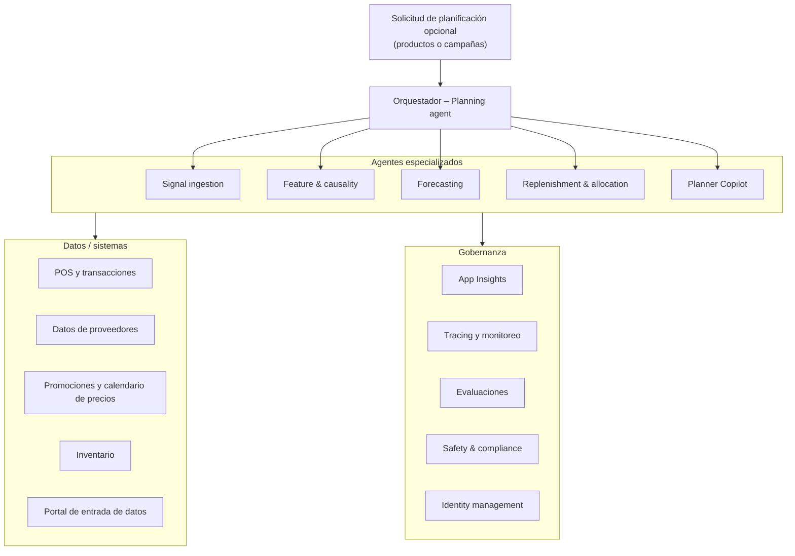

# Agentic Inventory Planning and Trend Forecasting — Workflow Summary

Referencia de negocio y funcionalidad basada en el diagrama de arquitectura del proyecto.

## Problema de negocio

Sistema de **planificación de inventario y pronóstico de tendencias** para retail, distribución o manufactura. Automatiza y mejora decisiones de supply chain: qué comprar, cuánto, cuándo y dónde, usando señales en tiempo real y pronósticos, con supervisión humana donde corresponda.

Desafíos que aborda:

- Prever demanda (tendencias, estacionalidad, promociones)
- Decidir reposición y asignación entre almacenes/tiendas
- Respetar presupuesto y niveles de servicio (evitar quiebres de stock y sobrestock)
- Reaccionar a cambios (anomalías, nuevas campañas, datos de proveedores)

## Flujo general



## Capas de la arquitectura

### 1. Orquestador (Planning agent)

- **Rol:** coordinar el flujo entre agentes.
- **Entrada:** solicitud de planificación opcional (productos o campañas concretas).
- **Función:** definir qué agentes corren, en qué orden y con qué contexto.

### 2. Agentes especializados

Cada agente comparte la misma pila técnica:

| Componente   | Tecnología              |
|--------------|-------------------------|
| Plataforma   | Foundry Agent Service   |
| Modelo       | Grok 4.3                |
| Memoria      | Contexto entre pasos    |
| Integración  | Azure MCP               |

| Agente                         | Responsabilidad de negocio                                                                 |
|--------------------------------|--------------------------------------------------------------------------------------------|
| **Signal ingestion**           | Ingesta señales en tiempo real; valida calidad de datos (RAG)                              |
| **Feature & causality**        | Construye eventos y predictores; mide impacto de drivers y elasticidades                   |
| **Forecasting**                | Pronóstico corto plazo (trend); detecta cambios y anomalías                                |
| **Replenishment & allocation** | Recomienda objetivos y pedidos; crea POs/TOs (órdenes de compra/transferencia)           |
| **Planner Copilot**            | Aplica restricciones de nivel de servicio y presupuesto; human-in-the-loop               |

### Orden de ejecución

En una planificación de punta a punta, los cinco agentes se ejecutan **en secuencia**, no en paralelo. El **Planning agent (orquestador)** invoca cada agente en orden y pasa el contexto acumulado (memoria entre pasos) al siguiente.

Aunque el diagrama muestre al orquestador conectado a todos los agentes, eso indica que **coordina** el flujo, no que corran todos a la vez. Cada etapa depende de la salida de la anterior.

**Cadena de ejecución:**

```
Signal ingestion → Feature & causality → Forecasting → Replenishment & allocation → Planner Copilot
```

| Agente | Qué hace | Implica que va… |
|--------|----------|-----------------|
| **Signal ingestion** | Trae señales en tiempo real (ventas, inventario, promos, proveedores) y valida su calidad (RAG) | **Primero** — sin datos confiables no hay planificación |
| **Feature & causality** | Construye eventos y predictores; mide qué drivers mueven la demanda (precio, promo, estacionalidad) y sus elasticidades | **Después de ingestar** — necesita señales ya validadas |
| **Forecasting** | Proyecta demanda a corto plazo, detecta tendencias, cambios y anomalías (RAG) | **Después de entender drivers** — el pronóstico usa esas variables |
| **Replenishment & allocation** | Traduce la demanda esperada en objetivos de stock y borradores de PO/TO (órdenes de compra o transferencia) | **Después del pronóstico** — convierte demanda en acciones de reposición |
| **Planner Copilot** | Verifica presupuesto y nivel de servicio; presenta el plan al planificador humano para aprobación | **Al final** — valida un plan ya propuesto antes de ejecutar pedidos |

En términos de supply chain, la ejecución sigue el pipeline: **datos → drivers → pronóstico → reposición → aprobación**.

**Secuencia lógica del workflow:**

1. Ingestar datos (ventas, promos, inventario, proveedores).
2. Entender causas (qué mueve la demanda).
3. Pronosticar demanda y tendencias.
4. Reponer y asignar stock (qué pedir y a dónde).
5. Validar con reglas de negocio y aprobación humana.

### 3. Datos / sistemas de registro

| Sistema                        | Uso                                              |
|--------------------------------|--------------------------------------------------|
| **POS y transacciones**        | Ventas reales (SQL)                              |
| **Supplier data**              | Proveedores, plazos, capacidad                   |
| **Promotions & price calendar**| Campañas y precios (RAG)                         |
| **Inventory**                  | Stock actual                                     |
| **Data Entry Portal**          | Entrada manual / correcciones                    |

Los agentes leen y escriben vía MCP contra estos sistemas.

### 4. Gobernanza y Responsible AI

- **App Insights** — rendimiento operativo
- **Tracing & monitoring** — trazabilidad de razonamiento y acciones
- **Evaluations** — calidad de pronósticos y decisiones
- **Safety & compliance** — políticas y normativa
- **Identity management** — acceso y seguridad

## Leyenda del diagrama

| Símbolo              | Significado                                                                 |
|----------------------|-----------------------------------------------------------------------------|
| Caja morada          | Agente                                                                      |
| Caja verde           | Modelo (Grok 4.3)                                                           |
| Caja beige           | Sistemas / datos externos                                                   |
| Caja azul            | Acciones del agente                                                         |
| Persona (rosa)       | Human-in-the-loop (Planner Copilot)                                         |
| Lupa (RAG)           | Retrieval-Augmented Generation: calidad de señales, tendencias, precios     |

## Caso de uso de ejemplo

**Entrada:** "Planificar inventario para la campaña de verano en categoría X".

1. **Orquestador** reparte el trabajo entre agentes.
2. **Signal ingestion** trae ventas, promos e inventario; valida calidad.
3. **Feature & causality** identifica drivers (precio, promo, estacionalidad).
4. **Forecasting** proyecta demanda y detecta anomalías.
5. **Replenishment** propone objetivos de stock y órdenes (PO/TO).
6. **Planner Copilot** comprueba presupuesto y nivel de servicio; un planificador humano aprueba o ajusta.

## Implicaciones para la implementación

| Dimensión        | Implicación                                                              |
|------------------|--------------------------------------------------------------------------|
| **Dominio**      | Supply chain / retail: demand planning, replenishment, allocation        |
| **Arquitectura** | Multi-agente con orquestación, no un solo chatbot                        |
| **Integraciones**| POS, ERP/inventario, proveedores, promociones, portal de datos           |
| **IA**           | LLM (Grok) + RAG + memoria + herramientas (MCP)                          |
| **Operación**    | Trazabilidad, evaluación y compliance desde el diseño                    |
| **Humano**       | Aprobación explícita en la etapa final (no ejecución autónoma de pedidos)|
